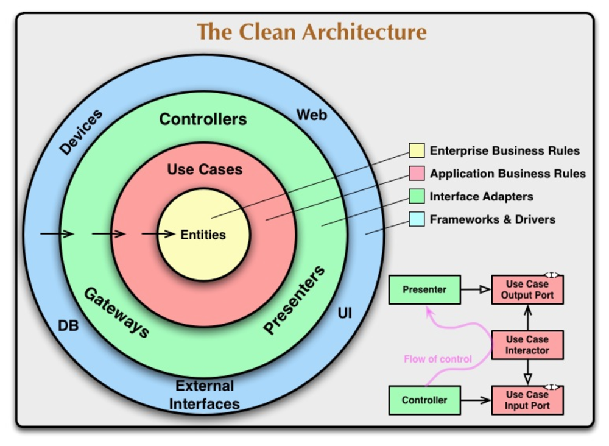

# 目的

関心ごとの分離

## レイヤー

- ビジネスルール
- ユーザーとのインタフェース
- システムとのインタフェース

## 特性

### フレームワーク非依存

ライブラリに依存しないため、ライブラリをツールとして利用できる。

### テスト可能

ビジネスルールは、UIやDBに依存しないため、単体テストが可能。

### UI非依存

ビジネスルールは、UIに依存しないため、UIを変更しても影響を受けない。

### DB非依存

ビジネスルールは、DBに依存しないため、DBを変更しても影響を受けない。DBに束縛されない。

### 外部エージェント非依存

ビジネスルールは、外界のインタフェースについて何も知らない。

## クリーンアーキテクチャ

### 依存性のルール

- 縁の外側は仕組み、内側は方針
- **ソースコードの依存性は、内側だけに向けってなければならない**

### エンティティ

- 企業全体の最重要のビジネスルールをカプセル化したもの
- 企業にあるさまざまなアプリケーションから仕様できるならエンティティはなんであってもいい
- **外部（システムやセキュリティ等）に変更があってもエンティティが影響を受けることはない**

### ユースケース

- アプリケーション固有のビジネスルール
- エンティティに入出力するデータの流れを調整する
- **ユースケースの変更がエンティティに影響を与えることはなく**、UIやシステム等外部の変更の影響を受けない
- ただし、ユースケースの変更はユースケースのどこかに影響を及ぼすことはある

### インタフェースアダプター

- エンティティやユースケースのデータフォーマットから外部（DBやUI）のフォーマットに変換する
- また、外部のフォーマットをユースケースに合わせて変換する

### フレームワークとドライバー

- 縁の一番外側でもっとも「詳細」に当たる

### 4つの円だけ？

- 内側に近づくほど抽象度が高くなる
- 外側はもっとも詳細

### 境界線を越える

- 依存関係逆転の法則（DIP）を利用して依存関係の矢印を逆に向けることができる
